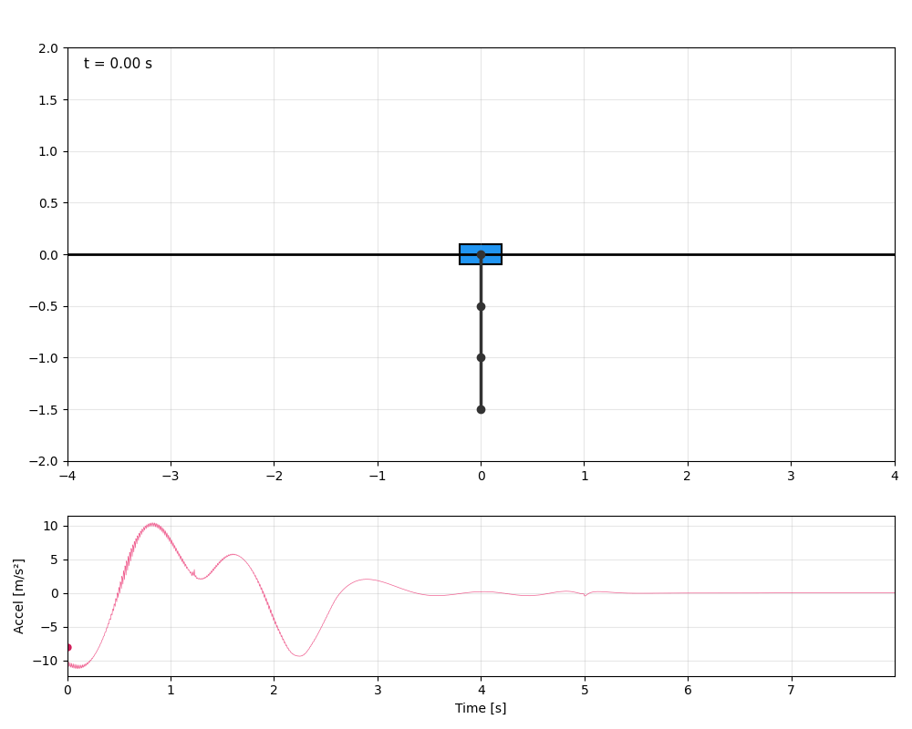
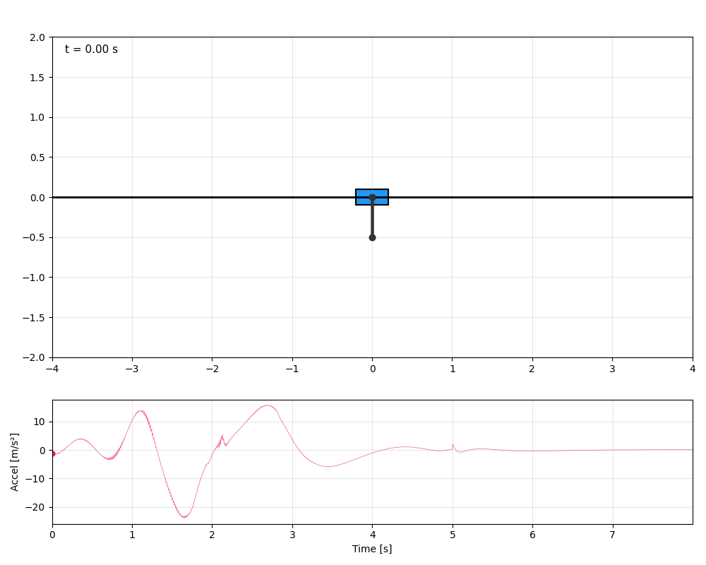
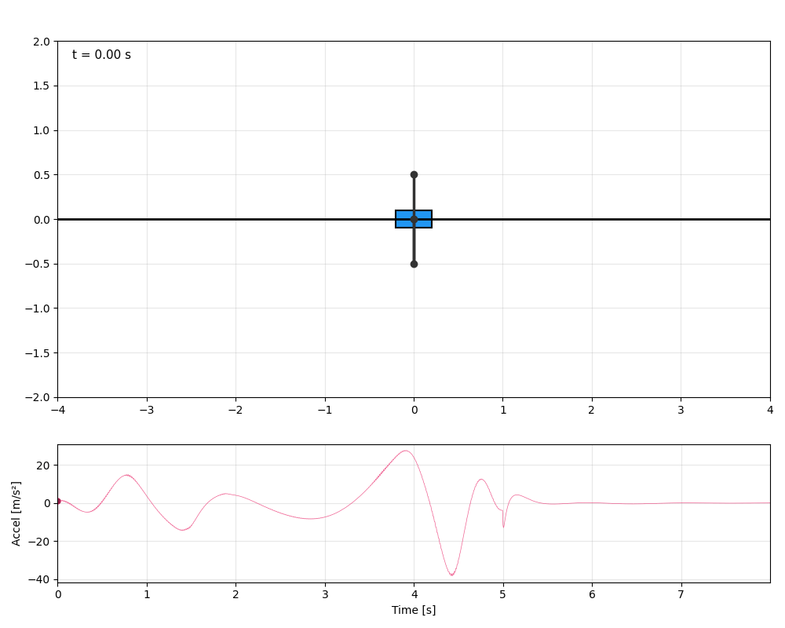

# Triple Inverted Pendulum − Swing-Up via TV-LQR

Swing-up and stabilization of a triple inverted pendulum on a cart using trajectory optimization (direct collocation) and time-varying LQR tracking.

### All down → up-up-down (ddd → uud)


### Down-up-down → all up (dud → uuu)


### Down-up-up → up-up-down (duu → uud)


## Usage

```bash
pip install -r requirements.txt
python run_transition.py
```

Edit `run_transition.py` to change the transition (e.g. `"ddd->uuu"`, `"uud->duu"`).
`u` = up (θ=0), `d` = down (θ=π).

## License

[MIT](LICENSE)
